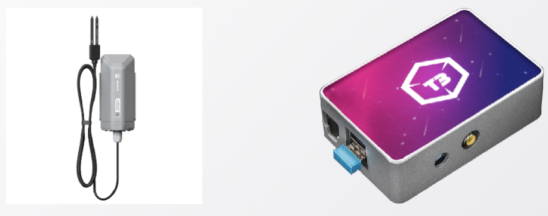
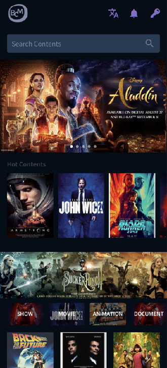
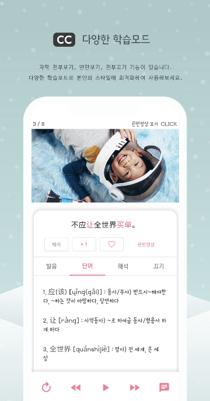
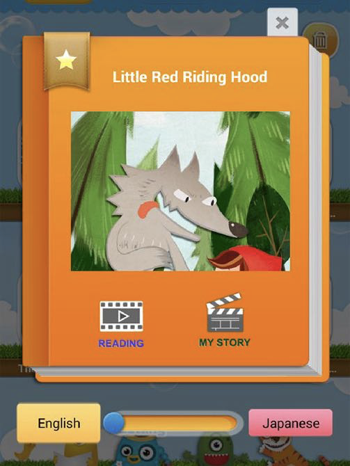
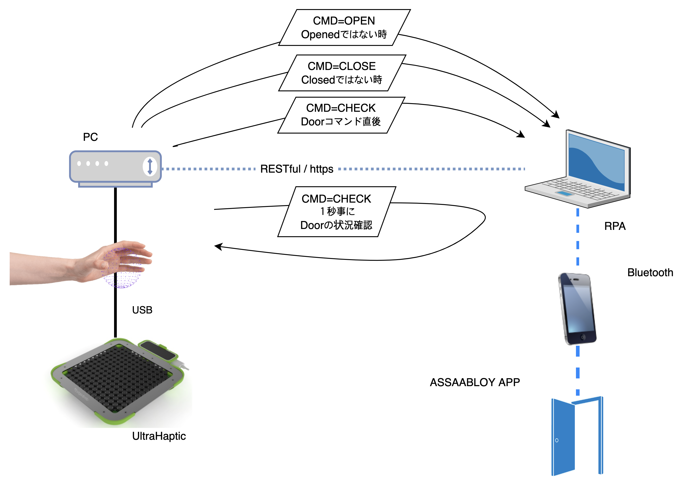

  Seongbum, Ryu
   
  istander@gmail.com
   
  https://www.linkedin.com/in/istander/

# Project Portfolios

These are representative cases that have been running a company or leading a team since 2010.

## Industrial Applications

### 2023 | An app for measuring size using LiDAR

An app that utilizes LiDAR, which started to be equipped on the 2020 Apple iPad/iPhone Pro models, to measure the dimensions of objects with a reliable precision at an industrial level. It uses 3D coordinates.

- iOS iPad & iPhone Pro
- Technologies : ARKit, AVFoundation, OpenCV, Open3d, Numpy etc, 
- Languages : Python, Swift

### 2022 | An application for pet health check-up using recognition and analysis of urine test strips for pets

This is an application that analyzes and diagnoses the health status of pets by capturing with a camera a litmus diagnostic kit that changes color in the urine of the pet.

The health analysis records of pets are stored in a database, and user and pet privacy is safely protected.

- iOS / Android 

- Color analysis technology, color channel separation, color correction and binarization technology, and image processing techniques.
- Flutter, OpenCV

|  |  |  |
| ------------------------------------------------------------ | ------------------------------------------------------------ | ------------------------------------------------------------ |
|  |  |  |

### 2021 | Development of AI for operation of marine debris collection drone

We collaborate with a maritime drone company to jointly develop a drone for marine debris collection. Our role includes developing an AI system for recognizing marine debris and managing the drone's control and operation, as well as developing a system for managing the overall drone fleet.

|  |  |
| ------------------------------------------------------------ | ------------------------------------------------------------ |
|  |  |

- Ocean Garbage Drone
- iOS / Android (Controller )
- Web ( Admin )

- Server / Client : Flask / React, React Native
- AI : YoloV4 / Tensorflow
- H/W : Python / Mavlink

### 2022 | Smart parking management application

A system for streamlining parking lot management in conjunction with an apartment community service, where parking lot management personnel can manage the status of the parking lot via photos on their mobile app.

- Android / Ubuntu
- AI : YoloV4, Tensorflow
- Server: Python, Flask, OpenCV, Pytesseract

|  |  |  |  |
| ------------------------------------------------------------ | ------------------------------------------------------------ | ------------------------------------------------------------ | ------------------------------------------------------------ |

### 2017 | Injection Defect Detection System

We developed a prototype system for detecting defects in injection-molded products at a plastic injection factory

- Window : Camera Controller
- Web : Management
- Image Detection & Camera Controller : MFC & Basler SDK
- Admin : Spring, MySQL

|  |  |  |
| ------------------------------------------------------------ | ------------------------------------------------------------ | ------------------------------------------------------------ |

### 2020 | Blockchain IoT refrigerated container tracking system

To continuously track and record the status of refrigerated containers on the blockchain, we developed a LoRA communication, hardware and IoT blockchain and central blockchain DApp and operational solution. We demonstrated the communication and status of the actual container on a ship carrying the container

- AWS for Blockchain Node & Server
- LoRA Arduino Sensor 
- Raspberry PI 4 for BIoT
- Humidity & Temperature Sensor for Container

- DAG type edge device of Blockchain for IoT 
- Ethereum for Central Blockchain 
- Admin : Spring, MySQL

|  |  |
| ------------------------------------------------------------ | ------------------------------------------------------------ |
|  |  |

### 2021 | Construction Project Information Management System

UnitePlug has developed a construction project information management system that addresses the needs of professional construction project management companies. Large-scale civil engineering and construction projects require significant resource investment, and UnitePlug's system manages and monitors complex construction resources and processes. The audit process is conducted through electronic approval, and data on each construction process is systematically preserved for management, assisting in the company's strategic decision-making and facilitating compliance with national construction regulations.

- iOS / Android / Web
- Spring, Mysql

|  |  |  |
| ------------------------------------------------------------ | ------------------------------------------------------------ | ------------------------------------------------------------ |

|  |
| ------------------------------------------------------------ |

## ASP Services

### 2022 | Mobile e-commerce system

UnitePlug's mobile commerce system is designed to optimize responsiveness and user experience by following the latest mobile trends and excluding unnecessary features. It is developed with React Native to ensure smooth usage on mobile platforms. 

The system can be customized to fit the business needs of the service provider, providing tailored services that reflect the preferences and needs of their customers.

UnitePlug's mobile commerce system aims to differentiate itself from existing systems by providing a unique user experience and helping service providers compete more effectively in the mobile commerce market.

|  |  |  |
| ------------------------------------------------------------ | ------------------------------------------------------------ | ------------------------------------------------------------ |

|  |
| ------------------------------------------------------------ |

### 2020 | Busan Content Market(Content-trading system)

Due to the impact of COVID-19, there has been an increasing demand for the transition of offline events to online platforms. As a result, the development of the Busan Contents Market was initiated. This system enables international buyers to view target contents through limited access and conduct transactions with suppliers by providing features such as content viewing control, online meetings, schedule management, and other necessary functions for online content trading.

- AWS Cloud, Web

- AWS MediaLive,CloudFront, S3
- Java, Spring(backend), React (frontend)

|  |
| ------------------------------------------------------------ |

|  |  |  |
| ------------------------------------------------------------ | ------------------------------------------------------------ | ------------------------------------------------------------ |

### 2020 | Global video streaming service

The application is a marketing tool for a global network marketing company, which includes marketing education videos and ebook content distribution, as well as customer management for each seller. Each piece of content can be distributed via AWS CDN to six countries including the United States, Korea, Japan, China, Indonesia, and Thailand.

- iOS / Android, Web

- AWS MediaLive, CloudFront, S3
- Java, Spring, React & ReactNative

|  |  |  |
| ------------------------------------------------------------ | ------------------------------------------------------------ | ------------------------------------------------------------ |

|  |
| ------------------------------------------------------------ |

### 2020 | Mandarin learning app through YouTube

This is a language learning service that allows users to learn Chinese through short content or advertisements on YouTube. It is specialized in language learning and offers features such as video segment repetition and synchronized subtitles on YouTube.

- Language Learning System with Real-time Integration with YouTube
- Content Creation and Upload System (Desktop App) for Administrators 

- iOS / Android

- Flutter / PHP / MySql

|  |  |  |  |
| ------------------------------------------------------------ | ------------------------------------------------------------ | ------------------------------------------------------------ | ------------------------------------------------------------ |

### 2018 | Tire Sales O2O Service

It is an O2O service that connects offline tire sales shops nationwide to online. It has a database of basic and recommended tires based on the user's car selection, and includes content related to car tire knowledge to encourage user engagement. 

When a user requests a tire estimate for their car, offline shops propose tire estimates through a reverse auction system, and the user reserves a tire replacement with the shop that provides the most beneficial offer. 

The service also has a settlement system for commission settlements on the administrator web.

- iOS / Android, Web ( Admin)

- Swift / Kotlin, Spring, Mysql

|  |  |  |
| ------------------------------------------- | ------------------------------------------- | ------------------------------------------- |
|  |  |  |

### 2015 | iLangStory( global multilingual educational storybook )

UnitePlug is a self-developed smart content service that offers a subscription-based content service with animated storybooks for learning six different languages in six countries. It also includes a function for children to re-create the story scenes. The service is integrated with the Rookia, a self-developed content creation system.

- iOS / Android

- Client : Object C / Java
- Admin : ROOKIA CMS

|  |  |
| ------------------------------------------------------------ | ------------------------------------------------------------ |
|  |  |

### 2014 | iLangSchool(Global foreign language learning app)

Self-Developed language learning service. 

Users can learn foreign languages by repeatedly watching and following fun content that matches their language level. User can learn English, Korean, Japanese, Spanish, French, and Chinese through the same content, and content creation and distribution are continuously integrated. ( Rookia )

- iOS / Android
- Client : Object C / Java
- Admin : ROOKIA CMS

|  |  |                    |
| ----------------------------------------- | ----------------------------------------- | ----------------------------------------------------------- |
|      |      |  |

### 2014 | Rookia ( Reusable multi-lingual Object based contents editor )

Rookia is a content creation system based on reusable multilingual objects.
Rookiea can lower the content production cost more than twice as much as the content production cost produced with Flash.
Contents are created through the step-by-step participation of content creators, and the content is seamlessly distributed to the app.

- Seamless contents distribution

- Based on reusable multi-lingual objects

- Patent Registered

  

|  |
| ------------------------------------------------------------ |
|  |

|  |  |
| ------------------------------------------------------------ | ------------------------------------------------------------ |
|  |  |

### 2013 | Multi-language smart menu service

With the widespread use of smartphones and iPads, we have developed a smart menu targeting high-end restaurants. It is designed with a beautiful interface and fast responsiveness as a native app, and administrators can register new menu items, discounts, coupons, etc. on the management web page. The biggest feature is that food menu items are easy to understand even for foreign tourists, using photos and automatic translation of the existing menu descriptions. This allows for minimal content management in the restaurant.

- iOS / Android, Web ( Admin)
- Client : Swift(iOS), Java(Android), 
- Admin : Spring, JSF, JPA, MySql

|  |  |
| ------------------------------------------------------------ | ------------------------------------------------------------ |
|  |  |

## 3D & Metaverse

### 2023 | UltraHaptic door handle(PoC)

We have implemented a concept of a virtual door handle using the UltraHaptic Device. The UltraHaptic is a device consisting of an array of small speakers capable of producing ultrasonic output. By causing resonance through the phase difference of the speaker sound, it can produce tactile feedback in the user's hand. With this device, users can virtually grab a door handle in space and open or close a virtual door without physically touching it (contactless virtual door handle). 

This was developed as a proof of concept, and consists of the UltraHaptic device, a PC connected to it, a screen displaying virtual objects, and a control server to control the device that opens the actual door.

- UltraHaptic Device, Ubuntu, MacOS

- Unity, UltraHaptic SDK, Python

|  |
| ------------------------------------------------------------ |
|  |

### 2022 | Metaverse meeting system

Due to the impact of COVID-19, the MICE (Meetings, Incentives, Conferences, and Exhibitions) industry, which was centered around offline events, needs to find new business opportunities. This system is a virtual exhibition platform developed based on the demands of the MICE industry. It allows for multi-user access to a 3D virtual exhibition space, online video meetings, content screening, schedule management, and more.

- iOS / Android / Web / AWS Cloud

- Unity, Python, AWS Media Live

|  |
| ------------------------------------------------------------ |
|  |
|  |

## Blockchain Solutions

### 2020 | Crypto-Currency Exchange System

- Processing performance of 10M transactions per second
- Adoption records in 10 or more locations
- Solution with ISMS-P security certification
- Special mechanisms to protect digital assets from hacking
- Scalable and flexible structure for scale-out
- Consultation and adoption prices are available upon request.

- AWS Cloud, iOS / Android / Web

- Blockchain Wallet 
- Matching Engine
- Java / React

|  |
| ------------------------------------------------------------ |
|  |

### 2019 | Blockchain-based content transaction system ( Proof-of- Stake )

A content trading system where ownership of the content is purchased using blockchain tokens. The copyright holder issues a limited quantity of tokens for a specific digital content, and buyers acquire ownership of the content through the copyright transaction. The buyer's ownership of the content is permanently stored on the Ethereum blockchain.

- AWS Cloud, iOS / Android / Web

- Blockchain Wallet
- Ethereum DApp
- Java, React

|  |  |  |
| ------------------------------------------------------------ | ------------------------------------------------------------ | ------------------------------------------------------------ |

|  |  |
| ------------------------------------------------------------ | ------------------------------------------------------------ |

